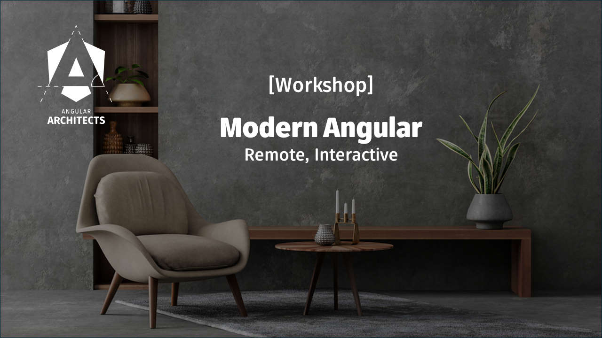

# Intro

At the beginning of 2023, Sarah Drashner, who as Director of Engineering at Google also heads the Angular team, coined the term Angular Renaissance. This term means a renewal of the framework that has supported us in the development of modern JavaScript solutions for seven years now.

This renewal is incremental and backwards compatible and takes current trends from the world of front-end frameworks into account. This is primarily about developer experience and performance. Standalone Components and Signals are two well-known features that have already emerged as part of this movement.

In this book, I discuss the innovations that come with the Angular Renaissance using several examples. Chapters 1 and 2 discuss Standalone Components and the subsequent chapters 3 to 7 go in depth with the new Standalone APIs -- renewed Angular APIs for routing, lazy loading, http access, web components, and testing streamlining application development not only in a Standalone world. Chapters 8 and 9 show how you can automatically migrate your code to Standalone.

Chapters 10 to 12 deal with Signals and how they affect data binding, your components, component communication, and your application architecture. Finally, chapters 13 and 14 explain what's behind the new control flow syntax, deferable views, and the improved SSR support including non-destructible hydration.

## Trainings and Consultancy

If you and your team need support or trainings regarding Angular, we are happy to help with **workshops and consulting** (on-site or remote). In addition to several other kinds of workshop, we provide the following ones:

- Advanced Angular: Enterprise Solutions and Architecture
- Angular Essentials: Building Blocks and Concepts
- Modern Angular Workshop
- Angular Micro Frontends Workshop
- Angular Testing Workshop (Cypress, Jest, etc.)
- Angular Performance Workshop
- Angular Design Systems Workshop (Figma, Storybook, etc.)
- Angular: Reactive Architectures (RxJS and NGRX)
- Angular Review Workshop
- Angular Upgrade Workshop

Please find [the full list of our offers here](https://www.angulararchitects.io/en/angular-workshops/).

[Modern Angular (English)](https://www.angulararchitects.io/en/training/modern-angular-workshop/) | [Modern Angular (German)](https://www.angulararchitects.io/training/modern-angular-workshop/)

We provide our workshops and consulting in various forms: **remote** or **on-site**; **public** or as **dedicated company workshops**; in **English** or in **German**.

If you have any questions, reach out to us at office@softwarearchitekt.at. 