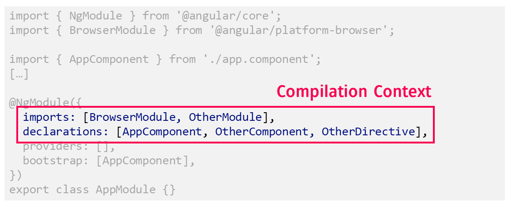
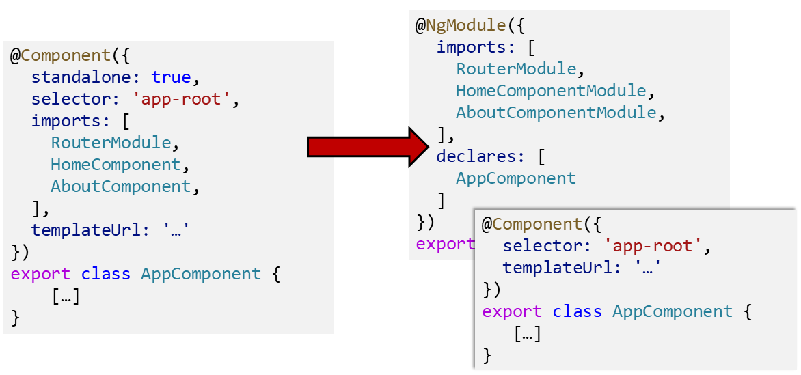

# Standalone Components: Mental Model & Compatibility

Standalone Components is one of the most exciting new Angular features since quite a time. They allow for working without NgModules and hence are the key for more lightweight and straightforward Angular solutions. A first implementation already landed in  Angular 14 BETA and the Angular Team tries hard to make them available until version 14 is released in the first half of 2022. 

In this book, I'm going to demonstrate how to leverage this innovation. For this, I'm using an example application completely written with Standalone Components.

>The **source code** for this can be found in the form of a traditional [Angular CLI workspace](https://github.com/manfredsteyer/standalone-example-cli) and as an [Nx workspace](https://github.com/manfredsteyer/standalone-example-nx) that uses libraries as a replacement for NgModules. 


## Why Did we Even Get NgModules in the First Place?

The main reason for initially introducing NgModules was pragmatic: We needed a way to group building blocks that are used together. Not only to increase the convenience for developers, but also for the Angular Compiler whose development lagged a little behind. In the latter case, we are talking about the compilation context. From this context, the compiler learns where the program code is allowed to call which components:

{width=60%}


However, the community was never really happy with this decision. Having another modular system besides that of EcmaScript didn't feel right. In addition, it raised the entry barrier for new Angular developers. That is why the Angular team designed the new Ivy compiler so that the compiled application works without modules at runtime. Each component compiled with Ivy has its own compilation context. Even if that sounds grandiose, this context is just represented by two arrays that refer to adjacent components, directives, and pipes.

Since the old compiler and the associated execution environment have now been permanently removed from Angular as of Angular 13, it was time to anchor this option in Angular's public API. For some time there has been a design document and an associated RFC [RFC]. Both describe a world where Angular modules are optional. The word optional is important here: Existing code that relies on modules is still supported.

## Getting Started With Standalone Components

In general, implementing a Standalone Component is easy. Just set the `standalone` flag in the `Component` decorator to `true` and import everything you want to use:

```typescript
@Component({
  standalone: true,
  selector: 'app-root',
  imports: [
    RouterOutlet,
    NavbarComponent,
    SidebarComponent,
  ],
  templateUrl: './app.component.html',
  styleUrls: ['./app.component.css']
})
export class AppComponent {
    [...]
}
```

The `imports` define the compilation context: all the other building blocks the Standalone Components is allowed to use. For instance, you use it to import further Standalone Component, but also existing NgModules.

The exhaustive listing of all these building blocks makes the component self-sufficient and thus increases its reusability in principle. It also forces us to think about the component's dependencies. Unfortunately, this task turns out to be extremely monotonous and time consuming.

Therefore, there are considerations to implement a kind of auto-import in the Angular Language Service used by the IDEs. Analogous to the auto-import for TypeScript modules, the IDE of choice could also suggest placing the corresponding entry in the `imports` array the first time a component, pipe or directive is used in the template.

## The Mental Model

The underlying mental model helps to better understand Standalone Components. In general, you can imagine a Standalone Component as a component with its very own NgModule:



This is similar to [Lars Nielsen](https://twitter.com/LayZeeDK)'s SCAM pattern. However, while SCAM uses an explicit module, here we only talk about a thought one. 

While this mental model is useful for understanding Angular's behavior, it's also important to see that Angular doesn't implement Standalone Components that way underneath the covers.

## Pipes, Directives, and Services

Analogous to standalone components, there are also standalone pipes and standalone directives. For this purpose, the `pipe` and `directive` decorators also get a `standalone` property. This is what a standalone pipe will look alike:

```typescript
@Pipe ({
  standalone: true,
  name: 'city',
  pure: true
})
export class CityPipe implements PipeTransform {

  transform (value: string, format: string): string {[…]}

}
```

And here is an example for a standalone directive:
 
```typescript
@Directive ({
    standalone: true,
    selector: 'input [appCity]',
    providers: […]
})
export class CityValidator implements Validator {

    [...]

}
```
 
Thanks to tree-shakable providers, on the other hand, services have worked without modules for quite a time. For this purpose the property `providedIn` has to be used:
 
```typescript
@Injectable ({
  providedIn: 'root'
})
export class FlightService {[…]}
``` 

The Angular team recommends, to use `providedIn: 'root'` whenever possible. It might come as a surprise, but `providedIn: 'root'` also works with lazy loading: If you only use a service in lazy parts of your application, it is loaded alongside them.

## Bootstrapping Standalone Components

Until now, modules were also required for bootstrapping, especially since Angular expected a module with a bootstrap component. Thus, this so called `AppModule` or "root module" defined the main component alongside its compilation context. 

With Standalone Components, it will be possible to bootstrap a single component. For this, Angular provides a method `bootstrapApplication` which can be used in `main.ts`:

```typescript
// main.ts

import { bootstrapApplication } from '@angular/platform-browser';
import { provideAnimations } from '@angular/platform-browser/animations';
import { AppComponent } from './app/app.component';
import { APP_ROUTES } from './app/app.routes';
import { provideRouter } from '@angular/router';
import { importProvidersFrom } from '@angular/core';

[...]

bootstrapApplication(AppComponent, {
  providers: [
    importProvidersFrom(HttpClientModule),
    provideRouter(APP_ROUTES),
    provideAnimations(),
    importProvidersFrom(TicketsModule),
    importProvidersFrom(LayoutModule),
  ]
});
```

The first argument passed to `bootstrapApplication` is the main component. Here, it's our `AppComponent`. Via the second argument, we pass application-wide service providers. These are the providers, you would register with the `AppModule` when going with NgModules.

The provided helper function `importProvidersFrom` allows bridging the gap to existing NgModules. Please also note, that `importProvidersFrom` works with both NgModules but also `ModuleWithProviders` as returned by methods like `forRoot` and `forChild`. 

While this allows to immediately leverage existing NgModule-based APIs, we will see more and more functions that replace the usage of `importProvidersFrom` in the future. For instance, to register the router with a given configuration, the function `provideRouter` is used. Similarly, provideAnimations setup up the Animation module.

## Compatibility With Existing Code

As discussed above, according to the mental model, a Standalone Component is just a component with its very own NgModule. This is also the key for the compatibility with existing code still using NgModules. 

On the one side, we can import whole NgModules into a Standalone Component:

```typescript
import { Component, OnInit } from '@angular/core';
import { TicketsModule } from '../tickets/tickets.module';

@Component({
    selector: 'app-next-flight',
    standalone: true,
    imports: [
        // Existing NgModule imported 
        // in this standalone component
        TicketsModule
    ],
    [...]
})
export class NextFlightComponent implements OnInit {
    [...]
}
```

But on the other side, we can also import a Standalone Component (Directive, Pipe) into an existing NgModule:

```typescript
@NgModule({
  imports: [
    CommonModule,

    // Imported Standalone Component:
    FlightCardComponent,
    [...]
  ],
  declarations: [
    MyTicketsComponent
  ],
  [...]
})
export class TicketsModule { }
```

Interestingly, standalone components are **imported** like modules and not declared like classic components. This may be confusing at first glance, but it totally fits the mental model that views a standalone component a component with its very own NgModule.

Also, declaring a traditional component defines a strong whole-part relationship: A traditional component can only be declared by one module and then, it belongs to this module. However, a standalone component doesn't belong to any NgModule but it can be reused in several places. Hence, using `imports` here really makes sense.

## Side Note: The CommonModule

Doubtless, one of the most known NgModules in Angular was the `CommonModule`. It contains built-in directives like `*ngIf` or `*ngFor` and built-in pipes like `async` or `json`. While you can still import the whole `CommonModule`, meanwhile it's also possible to just import the needed directives and pipes:

```typescript 
import { 
    AsyncPipe, 
    JsonPipe, 
    NgForOf, 
    NgIf 
} from "@angular/common";

[...]

@Component({
  standalone: true,
  imports: [
    // CommonModule, 
    NgIf,
    NgForOf,
    AsyncPipe,
    JsonPipe,

    FormsModule, 
    FlightCardComponent,
    CityValidator,
  ],
  selector: 'flight-search',
  templateUrl: './flight-search.component.html'
})
export class FlightSearchComponent implements OnInit {
    [...]
}
```

This is possible, because the Angular team made Standalone Directives and Standalone Pipes out of the building blocks provided by the `CommonModule`. Importing these building blocks in a fine grained way will be especially interesting once IDEs provide auto-imports for standalone components. In this case, the first usage of an building block like `*ngIf` will make the IDE to add it to the `imports` array. 

> As we will see in a further part of this book, meanwhile also the `RouterModule` comes with Standalone building-blocks. Hence, we can directly import RouterOutlet instead of going with the whole `RouterModule`. When writing this, this was not yet possible for other modules like the `FormsModule` or the `HttpClientModule`.  


## Interim Conclusion: Standalone Components -- and now?

So far we've seen how to use Standalone Components to make our Angular applications more lightweight. We've also seen that the underlying mental model guarantees compatibility with existing code. 

However, now the question arises how this all will influence our application structure and architecture. The next chapter will shed some light on this.