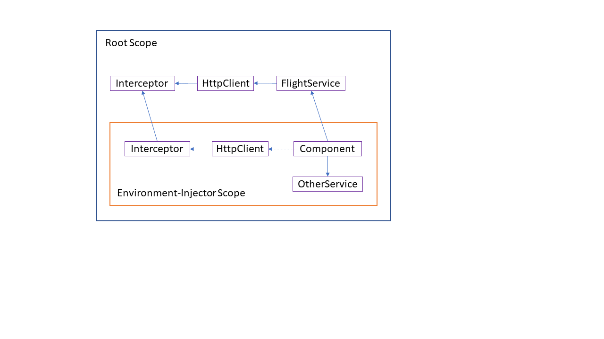

# The Refurbished HttpClient - Standalone APIs and Functional Interceptors

Without any doubt, the `HttpClient` is one of the best-known services included in Angular. For version 15, the Angular team has now adapted it for the new standalone components. On this occasion, the interceptor concept was also revised.

In this chapter, I will describe these innovations. 

📂 [Source Code](https://github.com/manfredsteyer/standalone-example-cli.git)


## Standalone APIs for HttpClient

Beginning with version 15, the `HttpClient` can be set up without any reference to the `HttpClientModule`. Instead, we can use `provideHttpClient` when bootstrapping our application:

```typescript
import { provideHttpClient, withInterceptors } from "@angular/common/http";

[...]

bootstrapApplication(AppComponent, {
	providers: [
		provideHttpClient(
			withInterceptors([authInterceptor]),
		),
	]
});
```

This new function also enables optional features of the `HttpClient`. Each feature has its own function. For example, the `withInterceptors` function enables support for Http Interceptors.

The combination of a `provideXYZ` function and several optional `withXYZ` functions is not chosen arbitrarily here but corresponds to a pattern that the Angular team generally provides for standalone APIs. Application developers must therefore be on the lookout for functions that start with `provide` or `with` when setting up a new library.

Also, this pattern leads to a very pleasant side effect: libraries become more tree-shakable. This is because a static source code analysis makes it very easy to find out whether the application ever calls a function. In the case of methods, this is not so easy due to the possibility of polymorphic use of the underlying objects.

## Functional Interceptors

When introducing standalone APIs, the Angular team also took the opportunity and revised the `HttpClient` a bit. One result of this are the new functional interceptors. They allow interceptors to be expressed as simple functions. A separate service that implements a predefined interface is no longer necessary:

```typescript
import { HttpInterceptorFn } from "@angular/common/http";
import { tap } from "rxjs";

export const authInterceptor: HttpInterceptorFn = (req, next) => {

	console.log('request', req.method, req.url);
	console.log('authInterceptor')

	if (req.url.startsWith('https://demo.angulararchitects.io/api/')) {

		// Setting a dummy token for demonstration

		constheaders = req.headers.set('Authorization', 'Bearer Auth-1234567');

		req = req.clone({
			headers
		});

	}

	return next(req).pipes(
		tap(resp => console.log('response', resp))
	);

}
```

The interceptor shown adds an example security token to HTTP calls that are directed to specific URLs. Except that the interceptor is now a function of type `HttpInterceptorFn`, the basic functionality of this concept has not changed. As shown above, functional interceptors can be set up using `withInterceptors` when calling `provideHttpClient` .

## Interceptors and Lazy Loading

Interceptors in lazy modules have always led to confusion: As soon as a lazy module introduces its own interceptors, those of outer scopes – e.g. the root scope – are no longer triggered.

Even if modules with standalone components and APIs are a thing of the past, the basic problem remains, especially since (lazy) route configurations can now set up their own services:

```typescript 
export const FLIGHT_BOOKING_ROUTES: Routes = [{
	paths: '',
	component: FlightBookingComponent,
	providers: [
		MyService,
		provideState(bookingFeature),
		provideEffects([BookingEffects])
		provideHttpClient(
			withInterceptors([bookingInterceptor]),
			withRequestsMadeViaParent(),
		),
	],
}];
```

These services correspond to those the application previously registered in lazy modules. Technically, Angular introduces its own injector whenever such a `providers` array is available. This so-called environment injector defines a scope for the current route and its child routes.

The new `provideHttpClient` function can also be used in this `providers` array to register interceptors for the respective lazy part of the application. By default, the previously discussed rule applies: If there are interceptors in the current environment injector, Angular ignores the interceptors in outer scopes.

Exactly this behavior can be changed with `withRequestsMadeViaParent`: This method causes Angular to also trigger interceptors in outer scopes.

## Pitfall with withRequestsMadeViaParent

The discussed `withRequestsMadeViaParent` function comes with a non-obvious pitfall: a root-scope service is unaware of inner scope and the interceptors registered there. It always accesses the `HttpClient` in the root scope and therefore only the interceptors set up there are executed:



To solve this problem, the application could also register the outer service in the `providers` array of the route configuration and thus in the inner scope.

In general, however, it seems to be very difficult to keep track of such constellations. Therefore, it might make sense to do without interceptors in inner scopes altogether. As an alternative, a very generic interceptor in the root scope could be used. Such an interceptor may even load additional logic with a dynamic `import` from lazy applications parts.

## Legacy Interceptors and Other Features

While the new functional interceptors are very charming, applications can still take advantage of the original class-based interceptors. This option can be enabled using the `withLegacyInterceptors feature`. Then, the class-based interceptors are to be registered as usual via a multi-provider:

```typescript
bootstrapApplication(AppComponent, {
	providers: [
		provideHttpClient(
			withInterceptors([authInterceptor]),
			withLegacyInterceptors(),
		),
		{
			provide: HTTP_INTERCEPTORS,
			useClass: LegacyInterceptor,
			multiple: true,
		},
	]
});
```

## Further Features

The `HttpClient` has some additional features that can also be activated using `with-`functions: `withJsonpSupport`, for example, activates support for JSONP, and `withXsrfConfiguration` configures details on the use of XSRF tokens. If the application does not call `withXsrfConfiguration`, default settings are used. However, to completely disable the use of XSRF tokens, call `withNoXsrfProtection`.

## Conclusion

The revised `HttpClient` now wonderfully harmonizes with standalone components and associated concepts such as environment injectors. The Angular team also took the opportunity to revise the interceptors: They can now be implemented in the form of simple functions. In addition, it is now also possible to consider interceptors in outer scopes.
