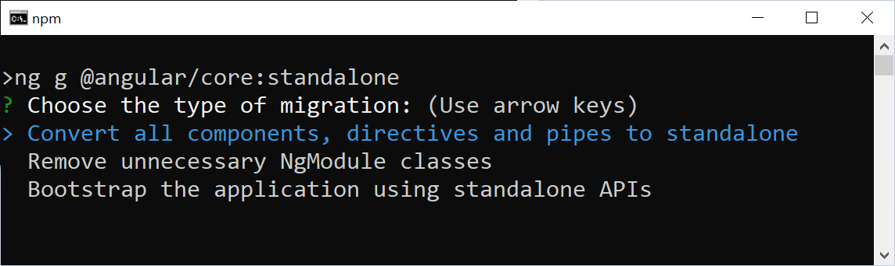
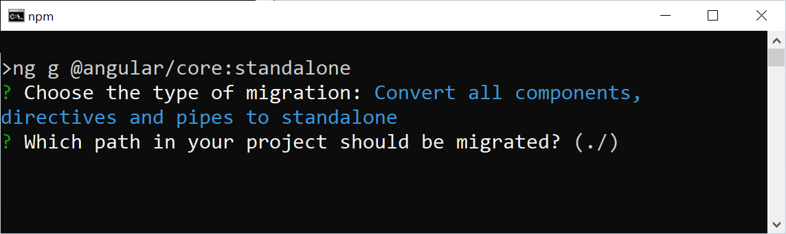
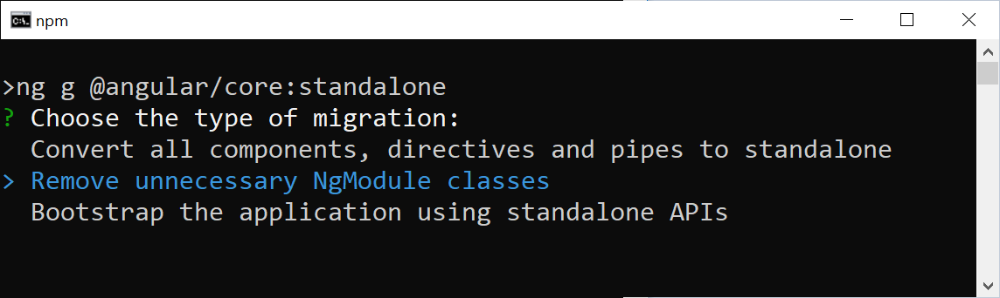
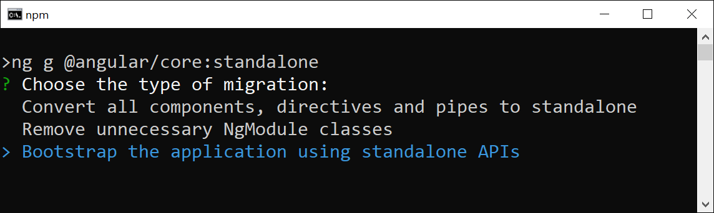

# Automatic Migration to Standalone Components in 3 Steps

While the new Standalone Components can be perfectly combined with traditional NgModule-based Angular code, people might want to fully migrate their projects to the new standalone world. Since Angular 15.2, there is a schematic that automates this task. In 3 steps it converts projects. After each step, we can check the current progress and manually take care of details the automatism could not cope with.

In this short tutorial, I'm going to step through these 3 steps with you and migrate our demo app.

If you want to play through these steps, you can find the NgModule-based initial situation of our tutorial here:

📂 https://github.com/manfredsteyer/standalone-example-cli <br>
(**Branch** `ngmodules`)


## A First Look at the Application to Migrate 

After checking out the `ngmodules` branch (!) of the above-mentioned project, it might be a good idea to go through the source code a bit. You should recognize the following NgModules: 


```bash
   +----> SharedModule < --------+
   |                             |
AppModule --- (lazy) ---> FlightBookingModule
```

Also, start the application to get a first impression of it:

```bash
ng serve -o
```


## Step 1

Now, let's run the migration schematic available from Angular 15.2:

```
ng g @angular/core:standalone
```

When asked about the type of migration, we select the first option (because it's such a nice tradition to "start at the beginning" ...). 



When asked about the path to migrate, we go with the default value by pressing enter:



This default value ``./`` points to the project's root. Hence, the whole project will be migrated at once. For small and medium-sized applications this should be fine. For bigger applications, however, it might be interesting to migrate the project gradually. 

After this first step, you should have a look at the source code and check if everything is fine. In the case of this example project, you don't need to bother. The schematics do a great job here!

## Step 2

Now, let's run the schematic again for the second step:



The output shows that the `SharedModule` was removed and the other modules have been updated. It's fine that the ``AppModule`` is still in place -- it will be removed in the 3rd step. However, all other NgModules should be gone by now. Unfortunately, the ``FlightBookingModule`` is still here:

```typescript
// src/app/booking/flight-booking.module.ts

@NgModule({
    imports: [
        CommonModule,
        FormsModule,
        StoreModule.forFeature(bookingFeature),
        EffectsModule.forFeature([BookingEffects]),
        RouterModule.forChild(FLIGHT_BOOKING_ROUTES),
        FlightCardComponent,
        FlightSearchComponent,
        FlightEditComponent,
        PassengerSearchComponent
    ],
    exports: [],
    providers: []
})
export class FlightBookingModule { }
```

As this listing shows, the ``FlightBookingModule`` doesn't do much anymore. However, there are some calls to methods within the `imports` section. These methods are for setting up the router and the NGRX store. As they are quite library-specific, the automatism was not able to convert them into calls of equivalent Standalone APIs. So, we need to take care of this by hand.

`RouterModule.forChild` sets up some child routes that are loaded alongside the `FlightBookingModule`. However, in a standalone world, we don't need NgModules for setting up child routes anymore. Instead, the parent routing configuration can **directly** point to the child routes. Hence, let's switch to the file `app.routes.ts` and update the route triggering lazy loading:


```typescript
// src/app/app.routes.ts

{
    path: 'flight-booking',
    canActivate: [() => inject(AuthService).isAuthenticated()],
    loadChildren: () =>
        import('./booking/flight-booking.routes')
                .then(m => m.FLIGHT_BOOKING_ROUTES)
},
```

Please note that the `import` now directly imports the flight booking routes. There is no indirection via the `FlightBookingModule` anymore. There is even the possibility of shortening this further: If the file `flight-booking.routes.ts` exports the routes as its **default export**, we can skip the subsequent `then` call:


```typescript
{
    path: 'flight-booking',
    canActivate: [() => inject(AuthService).isAuthenticated()],
    loadChildren: () =>
        import('./booking/flight-booking.routes')
},
```

To make sure, the NGRX store is initialized for this lazy application part, we can register the respective providers directly for the lazy child routes:

```typescript
// src/app/booking/flight-booking.routes.ts
import { importProvidersFrom, inject } from '@angular/core';
[...]

export const FLIGHT_BOOKING_ROUTES: Routes = [
  {
    path: '',
    component: FlightBookingComponent,
    canActivate: [() => inject(AuthService).isAuthenticated()],
    providers: [
      importProvidersFrom(StoreModule.forFeature(bookingFeature)),
      importProvidersFrom(EffectsModule.forFeature([BookingEffects])),
    ],
    children: [
        [...]
    ],
  },
];
```

This new provider array sets up services that are only needed for the route at hand and its children. The function `importProvidersFrom` bridges over to the world of NgModules and allows retrieving their providers. 

Now, we can delete the `FlightBookingModule` (`src/app/booking/flight-booking.module.ts`).


## Step 3

Let's run our migration schematic for the 3rd time:



This removes the `AppModule` and updates the file `main.ts` to directly bootstrap the `AppComponent`. After this step, the application should work as before:

```
ng serve -o
```

## Bonus: Moving to Standalone APIs

When we look into the `main.ts`, we see that it still references several modules with `importProvidersFrom`:

```typescript
bootstrapApplication(AppComponent, {
  providers: [
    importProvidersFrom(
      BrowserModule,
      LayoutModule,
      LoggerModule.forRoot({
        level: LogLevel.DEBUG,
        appenders: [DefaultLogAppender],
        formatter: (level, cat, msg) => [level, cat, msg].join(';'),
      }),
      StoreModule.forRoot(reducer),
      EffectsModule.forRoot(),
      StoreDevtoolsModule.instrument(),
      MatToolbarModule,
      MatButtonModule,
      MatSidenavModule,
      MatIconModule,
      MatListModule
    ),
    {
      provide: HTTP_INTERCEPTORS,
      useClass: LegacyInterceptor,
      multi: true,
    },
    provideAnimations(),
    provideHttpClient(withInterceptorsFromDi()),
    provideRouter(APP_ROUTES, withPreloading(PreloadAllModules)),
  ],
});
```

Also, there is a traditional class-based `HttpInterceptor` registered and the `HttpClient` is made aware of this by calling `withInterceptorsFromDi`. By moving to Standalone APIs, this can be improved:

```typescript
bootstrapApplication(AppComponent, {
  providers: [

    provideLogger({
      level: LogLevel.DEBUG,
      appenders: [DefaultLogAppender],
      formatter: (level, cat, msg) => [level, cat, msg].join(';'),
    }),

    provideStore(reducer),
    provideEffects(),
    provideStoreDevtools(),

    provideAnimations(),

    provideHttpClient(withInterceptors([authInterceptor])),
    provideRouter(APP_ROUTES, withPreloading(PreloadAllModules)),

    importProvidersFrom(
      LayoutModule,
      MatToolbarModule,
      MatButtonModule,
      MatSidenavModule,
      MatIconModule,
      MatListModule
    ),
    
  ],
});
```

This modification takes care of the following aspects:

* Removing the import of the `BrowserModule` that doesn't need to be explicitly imported when bootstrapping a Standalone Component.
* Setting up the custom Logger library with `provideLogger`.
* Setting up the NGRX store with `provideStore`, `provideEffects`, and `provideStoreDevtools`.
* Replacing the traditional `HttpInterceptor` with a [functional interceptor](https://www.angulararchitects.io/en/aktuelles/the-refurbished-httpclient-in-angular-15-standalone-apis-and-functional-interceptors/) that is now passed to `withInterceptors`. To make this step easier, the functional counterpart has already been part of the code base since the beginning.

More information about [custom Standalone APIs](https://www.angulararchitects.io/en/aktuelles/patterns-for-custom-standalone-apis-in-angular/) like provideLogger can be found [here](https://www.angulararchitects.io/en/aktuelles/patterns-for-custom-standalone-apis-in-angular/).

NGRX expects that its Standalone APIs are used fully or not at all. Hence, we also need to go back to the `flight-booking.routes.ts` and replace the call to `importProvidersFrom` with calls to `provideState` and `provideEffects`:


```typescript
export const FLIGHT_BOOKING_ROUTES: Routes = [
  {
    path: '',
    component: FlightBookingComponent,
    canActivate: [() => inject(AuthService).isAuthenticated()],
    providers: [
      provideState(bookingFeature),
      provideEffects(BookingEffects)
    ],
    children: [
        [...]
    ],
  },
];
```

Please note that while we call `provideStore` in the `main.ts` to set up the store, we need to call `provideState` (!) in further parts of the application to set up additional feature slices for them. However, `provideEffects` can be called in both places to set up effects for the root level but also feature slices.

After this modification, the application is migrated to Standalone Components and APIs. Run it via

```
ng serve -o
```

## Conclusion

The new schematics automate the migration to Standalone Components. In three steps, the whole application or just a part of it is moved over to the new lightweight way of working with Angular. After each step, we can check the performed modification and intervene.
