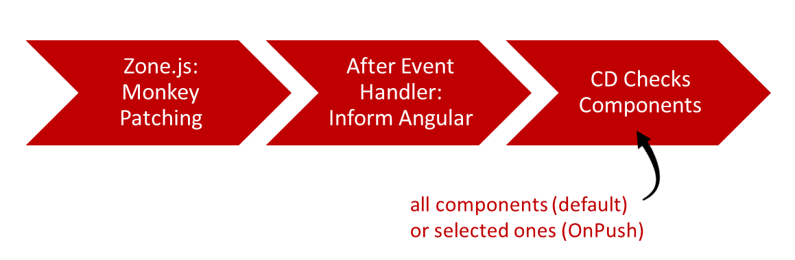

# Signals in Angular: The Future of Change Detection

Sarah Drasner, Director of Engineering at Google, spoke of an Angular renaissance on Twitter. That's pretty much it because several innovations have made Angular extremely attractive in the last few releases. Probably the most important are standalone components and standalone APIs.

Next, the Angular team takes care of renewing the change detection. It should be more lightweight and powerful. To do this, Angular will rely on a reactive mechanism called Signals, which several other frameworks have already adopted.

Signals will be available from Angular 16. Similar to standalone components, they initially come as a developer preview so that early adopters can gain initial experience.

In this chapter, I will go into this new mechanism and show how it can be used in an Angular application.

📂 [Source Code](https://github.com/manfredsteyer/standalone-example-cli)(see **branches**`signal` and `signal-rxjs-interop`)

## Change Detection Today: Zone.js

Angular currently assumes that any event handler can theoretically change any bound data. For this reason, after the execution of event handlers, the framework checks all bindings in all components for changes by default. In the more powerful OnPush mode, which relies on Immutables and Observables, Angular can drastically reduce the number of checked components.

Regardless if we go with the default behavior or OnPush, Angular needs to know when event handlers have run. This is challenging because the browser, not the framework, triggers the event handlers. Zone.js helps here: Using monkey patching, it extends JavaScript objects such as `window` or `document` and prototypes such as `HtmlButtonElement`, `HtmlInputElement` or `Promise`. By modifying such standard constructs, Zone.js can determines when an event handler has run. It then notifies Angular that it takes care of the change detection:



While this approach has worked well in the past, it still comes with a few downsides:

- Zone.js monkey patching is magic. Browser objects are modified, and errors are difficult to diagnose.
- Zone.js has an overhead of around 100 KB. While negligible for larger applications, this is a deal-breaker when deploying lightweight web components.
- Zone.js cannot monkey-patch `async` and `await` as they are keywords. Therefore, the CLI still converts these statements into promises, even though all supported browsers already support `async` and `await` natively.
- When changes are made, entire components including their predecessors, are always checked in the component tree. It is currently not possible to directly identify changed components or to just update the changed parts of a component.

Exactly these disadvantages are now compensated with Signals.

## Change Detection Tomorrow: Signals

A signal is a simple reactive building block: it holds a value consumers can read. Depending on the nature of the signal, the value can also be changed, after which the signal notifies all consumers:


If the consumer is a template, it can notify Angular about changed bindings. In the terminology of the Angular team, the signal occurs as a so-called producer. As described below, there are also other building blocks that can fill this role.

## Using Signals

For using Signals with data binding, properties to be bound are expressed as signals:

```typescript
@Component([…])
export class FlightSearchComponent {

  private flightService = inject(FlightService);

  from = signal('Hamburg');
  to = signal('Graz');
  flights = signal<Flight[]>([]);

  […]

}
```

It should be noted here that a signal always has a value by definition. Therefore, a default value must be passed to the `signal` function. If the data type cannot be derived from this, the example specifies it explicitly via a type parameter.

The Signal's getter is used to read the value of a signal. Technically, this means that the signal is called like a function:

```typescript
async search(): Promise<void> {
  if (!this.from() || !this.to()) {
    return;
  }
  const flights = await this.flightService.findAsPromise(this.from(), this.to());
  this.flights.set(flights);
}
```

To set the value, the signal offers an explicit setter in the form of a `set` method. The example shown uses the setter to stow the loaded flights. The getter is also used for data binding in the template:

```html
<div *ngIf="flights().length > 0">
  {{flights().length}} flights found!
</div>

<div class="row">
  <div *ngFor="let f of flights()">
    <flight-card [item]="f" />
  </div>
</div>
```

Method calls were frowned upon in templates in the past, especially since they could lead to performance bottlenecks. However, this does not generally apply to uncomplex routines such as getters. In addition, the template will appear here as a consumer, and as such, it can be notified of changes.

As of writing this, `ngModel` has not directly supported two-way data binding. However, it can be done by hand by setting up a property binding reading the signal and an event binding updating the signal with the field's current value:

```html
<form #form="ngForm">
  <div class="form-group">
    <label>From:</label>
    <input [ngModel]="from()" (ngModelChange)="from.set($event)" name="from" class="form-control">
  </div>

  <div class="form-group">
    <label>To:</label>
    <input [ngModel]="to()" (ngModelChange)="to.set($event)" name="to" class="form-control">
  </div>

  <div class="form-group">
    <button class="btn btn-default" (click)="search()">Search</button>
    <button class="btn btn-default" (click)="delay()">Delay</button>
  </div>
</form>
```

In a future version, the Angular team will adopt the forms handling to Signals.

## Updating Signals

In addition to the setter shown earlier, Signals also provide an `update` method for projecting the current value to a new one:

```typescript
this.flights.update(f => {
  const flight = f[0];
  const date = addMinutes(flight.date, 15);
  const updated = {...flight, date};

  return [
    updated,
    ...f.slice(1)
  ];
});
```

## Signals Need to be Immutable

By default, a Signal content has to be immutable. For this reason, just updating the flight date in the previous section would not be sufficient. Instead, we have to clone the changed parts, so that they get a new object reference. 

By comparing these references, Angular's OnPush change detection strategy can efficiently determine the changed parts of an object managed by a Signal. In the previous section, the Array and the first flight get an new object reference. The other flights are not changed and hence just copied over using `slice`. As a result, they keep their object reference. 

## Calculated Values, Side Effects, and Assertions

Some values are derived from existing values. Angular provides calculated signals for this:

```typescript
flightRoute = computed(() => this.from() + ' to ' + this.to());
```

Such a signal is read-only and appears as both a consumer and a producer. As a consumer, it retrieves the values of the signals used - here `from` and `to` - and is informed about changes. As a producer, it returns a calculated.

If you want to consume signals programmatically, you can use the `effect` function:

```typescript
constructor() {
    effect(() => {
        console.log('from:', this.from());
        console.log('route:', this.flightRoute());
    });
}
```

The `effect` function executes the transferred lambda expression and registers itself as a consumer for the signals used. When one of these signals change, the the effect is triggered again.

If a signal changes several times in a row or if several signals change one after the other, undesired interim results could occur. Let's imagine we change the search filter `Hamburg - Graz` to `London - Paris`:

```typescript
setTimeout(() => {
  this.from.set('London');
  this.to.set('Paris');
}, 2000);
```

Here, `London - Graz` could come immediately after the setting `from` to `London`. Like many other Signal implementations, Angular's implementation prevents such occurrences. The Angular team's [readme](https://github.com/angular/angular/blob/71d5cdae195f916e345d977f1f23f9490e09482e/packages/core/src/signals/README.md), which also explains the push/pull algorithm used, calls this desirable assurance "glitch-free".

## Effects Need an Injection Context

An essential limitation of Effects is that they can only be used in an injection context. This is everywhere `inject` is allowed: in the constructor, as default values of class fields, and in provider factories. Also, you can use the `runInInjectionContext` function to run code in an injection context.

Hence, the effect set up in the constructor above would fail when placed in `ngOnInit` or in another method:

```typescript
ngOnInit(): void {
    // Effects are not allowed here.
    // Hence, this will fail:
    effect(() => {
        console.log('route:', this.flightRoute());
    });
}
```

In this case, you'd get the following error:

> ERROR Error: NG0203: effect() can only be used within an injection context such as a constructor, a factory function,

The technical reason is that effects use `inject` to get hold of the current `DestroyRef`. This service provided since Angular 16 helps to find out about the life span of the current building block, e. g. the current component or service. The effect uses the `DestroyRef` to "unsubscribe" itself when this building block is about to be destroyed.

For this reason, you would typically setup your effects in the constructor as shown in the last section. If you really want to setup an effect somewhere else, you can go with the `runInInjectionContext` function. However, it needs a reference to an `Injector`:

```typescript
injector = inject(Injector);

ngOnInit(): void {
  runInInjectionContext(this.injector, () => {
    effect(() => {
      console.log('route:', this.flightRoute());
    });
  });
}
```

## Writing Signals in Effects

If an effect wrote a Signal, a cycle might be created. Just imagine an effect that reads the Signal `a` and updates Signal `b` and another effect doing the same the other way round. To prevent such situations, effects are not allowed to write Signals. For instance, let's assume an effect synchronizing our `from` and `to` Signals:

```typescript
effect(() => {
  // Writing into signals is not allowed here:
    this.to.set(this.from());
});
```

This effect would lead to the following error:

> ERROR Error: NG0600: Writing to signals is not allowed in a `computed` or an `effect` by default. Use `allowSignalWrites` in the `CreateEffectOptions` to enable this inside effects.

As an alternative, you should consider the usage of `computed`. If this does not work of if you **really** want to write into a signal, setting the `allowSignalWrites` property to true deactivates this child safety facility:

```typescript
effect(() => {
    this.to.set(this.from());
}, { allowSignalWrites: true })
```

## Signals and Change Detection

Similar to an Observable bound to a template using the `async`-Pipe, a bound Signal triggers change detection. This also works for the more efficient `OnPush` mode:

```typescript
@Component({
  [...]
  changeDetection: ChangeDetectionStrategy.OnPush
})
export class FlightSearchComponent { [...] } 

[...]

@Component({
  [...]
  changeDetection: ChangeDetectionStrategy.OnPush
})
export class FlightCardComponent { [...] } 
```

However, to help Angular in `OnPush` mode to also find out about child components to look at, you have to use Immutables, as discussed above.

## RxJS Interop

Admittedly, at first glance, signals are very similar to a mechanism that Angular has been using for a long time, namely RxJS Observables. However, signals are deliberately kept simpler. 

If you need the power of RxJS and its operators, you can however convert them to Observables. The namespace `@angular/core/rxjs-interop` contains a function `toObservable` converting a Signal into an Observable and a function `toSignal` for the other way round. They allow using the simplicity of signals with the power of RxJS.

The following listing illustrates the use of these two methods by expanding the example shown into a debounced type-ahead:

```typescript
@Component([...])
export class FlightSearchComponent {
  private flightService = inject(FlightService);

  from = signal('Hamburg');
  to = signal('Graz');
  basket = signal<Record<number, boolean>>({ 1: true });
  flightRoute = computed(() => this.from() + ' to ' + this.to());

  from$ = toObservable(this.from);
  to$ = toObservable(this.to);

  flights$ = combineLatest({ from: this.from$, to: this.to$ }).pipe(
    filter(c => c.from.length >= 3 && c.to.length >= 3),
    debounceTime(300),
    switchMap(c => this.flightService.find(c.from, c.to))
  );

  flights = toSignal(this.flights$, {
    initialValue: []
  });
}
```

The example converts the signals `from` and `to` into the observables `from$` and `to$` and combines them with `combineLatest`. As soon as one of the values changes, filtering and debouncing occur before `switchMap` triggers the backend request. One of the benefits flattening operators like `switchMap` come with are guarantees in terms of asynchronicity. These guarantees help to avoid race conditions.

The `initialValue` passed to toSignal is needed because Signals always have a value. On the contrary, Observables might not emit a value at all. If you are sure your Observable has an initial value, e.g., because it's a `BehaviorSubject` or because of using the `startsWith` operator, you can also set `requireSync` to `true`:

```typescript
flights = toSignal(this.flights, { 
    requireSync: true
});
```

If you neither set `initialValue` nor `requireSync`, the type of the returned Signal also supports the `undefinied` type, allowing an initial value of `undefined`. In the example shown, this would result in a `Signal<Flight[] | undefinied>` instead of `Signal<Flight[]>`. Consequently, your code has to check for `undefined` too.

## NGRX and Other Stores?

So far, we directly created and managed the Signals. However, stores like NGRX will provide some additional convenience. For instance, beginning with NGRX 16, the store will come with a `selectSignal` method:

```typescript
store = inject(Store);
flights = this.store.selectSignal(selectFlights);
```

Other store implementations will have similar adoptions.

## Conclusion

Signals make Angular lighter and point the way to a future without Zone.js. They enable Angular to find out about components that need to be updated directly.

The Angular team remains true to itself: Signals are not hidden in the substructure or behind proxies but made explicit. Developers therefore always know which data structure they are actually dealing with. Also, signals are just an option. No one needs to change legacy code and a combination of traditional change detection and signal-based change detection will be possible.

In general, it should be noted that Signals is still in an early phase and will ship with Angular 16 as a developer preview. This allows early adopters to try out the concept and provide feedback. With this, too, the Angular team proves that the stability of the ecosystem is important to them - an important reason why many large enterprise projects rely on the framework penned by Google.
