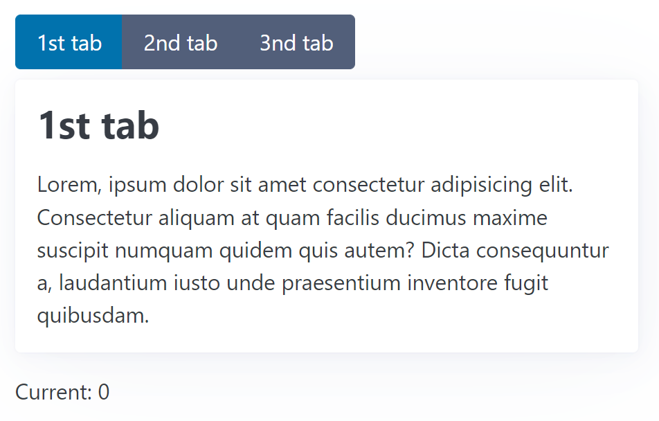
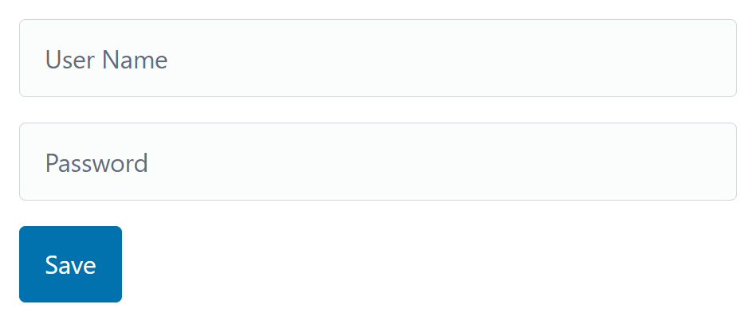
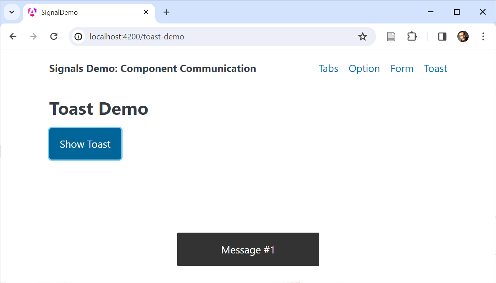
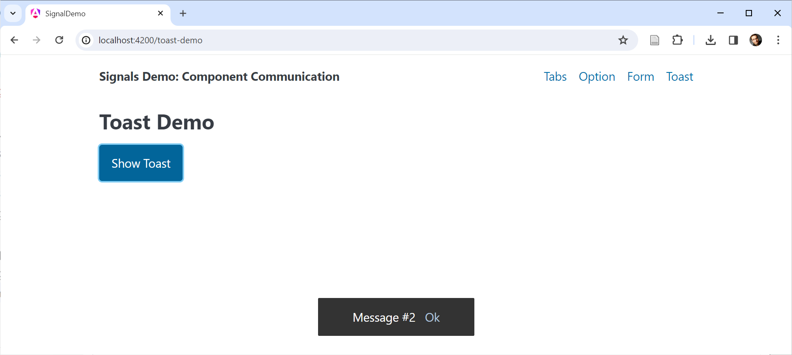

# Component Communication with Signals: Inputs, Two-Way Bindings, and Content/ View Queries

Signals will shape Angular's future. However, the Signals concept itself is just one part of the overall story. We also need a way to communicate with (sub)components via Signals. Angular 17.1 brought Input Signals, and with Angular 17.2 we've got Signal-based Two-way Bindings and support for content and view queries. To align with Input Signals, Version 17.3 provides a new output API.

In this chapter, I show how to use these new possibilities.

📁 [Source Code](https://github.com/manfredsteyer/signals-component-communication) (see different branches)


## Input Signals

Inputs Signals allow us to receive data via Property Bindings in the form of Signals. For describing the usage of Signal Inputs, I'm using a simple `OptionComponent` representing a -- for the sake of simplicity -- non-selectable option. Here, three of them are presented:


### Defining an Input Signal

Input Signals are the counterpart to the traditional @Input decorator:

```typescript
@Component({
  selector: 'app-option',
  standalone: true,
  imports: [],
  template: `
    <div class="option">
      {{ label() }}
    </div>
  `,
  styles: [...]
})
export class OptionComponent {
  label = input.required<string>();
}
```

This `input` function is picked up by the Angular Compiler, emitting source code for property bindings. Hence, we should only use it together with properties. The other communication concepts discussed here also use this technique.

Having a function instead of a decorator allows to inform TypeScript about the proper type and whether it includes `undefined`. In the example shown before, `label` becomes an `InputSignal<string>` -- an Input Signal providing a `string`. An `undefined` value is not possible as `input.required` defines a mandatory property.

An `InputSignal` is always read-only and can be used like a `Signal`. The template above, for instance, requests its current value by calling the getter (`label()`).

### Binding to an Input Signal

In the case of our `InputSignal<string>`, the caller has to pass a `string`:

```typescript
<app-option label="Option #1">
<app-option [label]="myStringProperty">
```

If this string comes from a Signal, we have to read it in the template:

```typescript
<app-option [label]="mySignalProperty()">
```

### Computed Signals and Effects as a Replacement for Life Cycle Hooks

All changes to the passed Signal will be reflected by the `InputSignal` in the component. Internally, both Signals are connected via the graph Angular is maintaining. Life cycle hooks like `ngOnInit` and `ngOnChanges` can now be replaced with `computed` and `effect`:

```typescript
markDownTitle = computed(() => '# ' + this.label())

constructor() {
  effect(() => {
    console.log('label updated', this.label());
    console.log('markdown', this.markDownTitle());
  });
}
```

### Options for Input Signals

Here are some further options for setting up an `InputSignal`:

| Source Code                                  | Description                                                                                            |
| -------------------------------------------- | ------------------------------------------------------------------------------------------------------ | ----------- |
| label = input<string>();                     | Optional property represented by an `InputSignal<string                                                | undefined>` |
| label = input('Hello');                      | Optional property represented by an `InputSignal<string>` with an initial value of `Hello`             |
| label = input<string \| undefined>('Hello'); | Optional property represented by an `InputSignal<string\| undefined>` with an initial value of `Hello` |

### Required Inputs Cannot Have a Default Value!

By definition, `input.required` cannot have a default value. This makes sense at first glance, however, there is a pitfall: If you try to read the value of a required input before it's been bound, Angular throws an exception.

Hence, you cannot directly access it in the constructor. Instead, you can use `ngOnInit` or `ngOnChanges`. Also, using inputs within `computed` or `effect` is always safe, as they are only first triggered when the component has been initialized:

```typescript
@Component([...])
export class OptionComponent implements OnInit, OnChanges {
  label = input.required<string>();

  // safe
  markDownTitle = computed(() => '# ' + this.label())

  constructor() {
  	// this would cause an exception,
	// as data hasn't been bound so far
	console.log('label', this.label);

	effect(() => {
		// safe
		console.log('label', this.label);
	})
  }

  ngOnInit() {
  	// safe
  	console.log('label', this.label);
  }

  ngOnChanges() {
  	// safe
  	console.log('label', this.label);
  }
}
```

### Aliases for Input Signals

Both `input` and `input.require` also take a parameter object that allows the definition of an `alias`:

```typescript
label = input.required({ alias: "title" });
```

In this case, the caller needs to bind to the property name defined by the alias:

```html
<app-option title="Option #1">
  <app-option [title]="myStringProperty">
    <app-option [title]="mySignalProperty()"></app-option></app-option
></app-option>
```

In most cases, you should prevent the usage of aliases, as they create an unnecessary indirection. An often-seen exception to this rule is renaming one of a Directive's properties to match the configured attribute selector.

### Transformer for Input Signals

Transformer have already been available for traditional @Inputs. They allow the transformation of a value passed via a property binding. In the following case, the transformer `booleanAttribute` that can be found in `angular/core` is used:

```typescript
@Component({
  selector: 'app-option',
  standalone: true,
  imports: [],
  template: `
    <div class="option">
      {{ label() }} @if (featured()) { ⭐ }
    </div>
  `,
  styles: [...]
})
export class OptionComponent {
  label = input.required<string>();
  featured = input.required({
    transform: booleanAttribute
  })
}
```

This transformer converts strings to booleans:

```html
<app-option label="Option #1" featured="true"></app-option>
```

Also, if the attribute is present but no value was assigned, `true` is assumed:

```html
<app-option label="Option #1" featured></app-option>
```

This Signal's type is `InputSignal<boolean, unknown>`. The first type parameter (`boolean`) represents the value received from the transformer; the second one (`unknown`) is the value bound in the caller's template and passed to the transformer. Besides `booleanAttribute`, @angular/core also provides a `numberAttribute` transformer that converts passed strings to numbers.

If you want to implement a custom transformer, just provide a function taking the bound value and returning the value that should be used by the called component:

```typescript
function boolTranformer(value: unknown): boolean {
  return value !== "no";
}
```

Then, register this function in your `input`:

```typescript
@Component([...])
export class OptionComponent {
  label = input.required<string>();
  featured = input.required({
    transform: boolTranformer
  })
}
```

## Two-Way Data Binding with Model Signals

Input Signals are read-only. If you want to pass a Signal that can be updated by the called component, you need to set up a so-called Model Signal. To demonstrate this, I'm using a simple `TabbedPaneComponent`:

{width=50%}


This is how the consumer can use this component:

```html
<app-tabbed-pane [(current)]="current">
  <app-tab title="1st tab"> Lorem, ipsum dolor sit amet ... </app-tab>
  <app-tab title="2nd tab"> Sammas ergo gemma, ipsum dolor ... </app-tab>
  <app-tab title="3nd tab"> Gemma ham ipsum dolor sit ... </app-tab>
</app-tabbed-pane>

<p class="current-info">Current: {{ current() }}</p>
```

It gets several `TabComponent`s passed. Also, a Signal `current` is bound via a Two-way Binding. For allowing this, the `TabbedPaneComponent` needs to provide a Model Signal using `model`:

```typescript
@Component([...])
export class TabbedPaneComponent {
  current = model(0);
  [...]
}
```

Here, `0` is the initial value. The options are similar to the ones for input: `model.required` defines a mandatory property, and you can provide an alias via an options object. However, a transformer can not be defined.

If this component updates the Model Signal, the new value is propagated up to the the Signal bound in the template:

```typescript
current.set(1);
```

### Two-Way Data Binding as Combination of Input and Output

As usual in Angular, also Signal-based Two-way Bindings can be defined with a (read-only) Input and a respective Output. The Output's name must be the Input's name with the suffix `Change`. Hence, for `current` we need to define `currentChange`:

```typescript
@Component([...])
export class TabbedPaneComponent {
  current = input(0);
  currentChange = output<number>();
}
```

For setting up an Output, we the new output API is used. For triggering an event, the application has to call the output's `emit` method:

```html
<button [...] (click)="currentChange.emit($index)">{{tab.title()}}</button>
```

## Content Queries with Signals

The `TabbedPaneComponent` introduced in the previous section also allows us to showcase another option: Content Queries that get hold of projected Components or Directives.

As shown above, a `TabbedPaneComponent` gets several `TabComponents` passed. They are projected into the `TabbedPaneComponent`'s view. However, we only want to display one of them at a given time. Hence, the `TabbedPaneComponent` needs to get programmatic access to its `TabComponents`. This can be done with the new `contentChildren` function:

```typescript
@Component({
  selector: 'app-tabbed-pane',
  standalone: true,
  imports: [],
  template: `
    <div class="pane">
      <div class="nav" role="group">
        @for(tab of tabs(); track tab) {
        <button
            [class.secondary]="tab !== currentTab()"
            (click)="activate($index)">
                {{tab.title()}}
        </button>
        }
      </div>
      <article>
        <ng-content></ng-content>
      </article>
    </div>
  `,
  styles: [...]
})
export class TabbedPaneComponent {
  current = model(0);
  tabs = contentChildren(TabComponent);
  currentTab = computed(() => this.tabs()[this.current()]);

  activate(active: number): void {
    this.current.set(active);
  }
}
```

The function `contentChildren` is the counterpart to the traditional @ContentChildren decorator. As `TabComponent` was passed as a so-called `locator`, it returns a Signal with an Array holding all projected `TabComponent`s.

Having the projected nodes as a Signal allows us to project them using `computed` reactively. The shown example uses this option to derive a Signal `currentTab`.

The projected `TabComponent` uses this Signal to find out whether it should be visible:

```typescript
@Component({
  selector: "app-tab",
  standalone: true,
  imports: [],
  template: `
    @if(visible()) {
    <div class="tab">
      <h2>{{ title() }}</h2>
      <ng-content></ng-content>
    </div>
    }
  `,
})
export class TabComponent {
  pane = inject(TabbedPaneComponent);

  title = input.required<string>();

  visible = computed(() => this.pane.currentTab() === this);
}
```

For this, we need to know that we can get all parents located in the DOM via dependency injection. The `visible` Signal is derived from the `currentTab` Signal.

This procedure is usual in the reactive world: Instead of imperatively setting values, they are declaratively derived from other values.

### Content Queries for Descendants

By default, a Content Query only unveils direct content children. "Grandchildren", like the 3rd tab below, are ignored:

```html
<app-tabbed-pane [(current)]="current">
  <app-tab title="1st tab"> Lorem, ipsum dolor sit amet ... </app-tab>
  <app-tab title="2nd tab"> Sammas ergo gemma, ipsum dolor ... </app-tab>

  <div class="danger-zone">
    <app-tab title="3nd tab">
      Here, you can delete the whole internet!
    </app-tab>
  </div>
</app-tabbed-pane>
```

To also get hold of such nodes, we can set the option `descendants` to `true`:

```typescript
tabs = contentChildren(TabComponent, { descendants: true });
```

## Output API

For the sake of API symmetricity, Angular 17.3 introduced a new output API. As already shown before, an `output` function is now used for defining an event provided by a component. Similar to the new input API, the Angular Compiler picks up the call to the `output` and emits respective code. The returned `OutputEmitterRef`'s `emit` method is used to trigger the event:

```typescript
@Component([...])
export class TabbedPaneComponent {
  current = model(0);
  tabs = contentChildren(TabComponent);
  currentTab = computed(() => this.tabs()[this.current()]);

  tabActivated = output<TabActivatedEvent>();

  activate(active: number): void {
    const previous = this.current();
    this.current.set(active);
    this.tabActivated.emit({ previous, active });
  }
}
```

### Providing Observables as Outputs

Besides this simple way of setting up outputs, you can use an Observable as the source for an output. For this, you find a function `outputFromObservable` in the RxJS interop layer:

```typescript
import { 
    outputFromObservable, 
    toObservable 
} from '@angular/core/rxjs-interop';
[...]

@Component([...])
export class TabbedPaneComponent {
  current = model(0);
  tabs = contentChildren(TabComponent);
  currentTab = computed(() => this.tabs()[this.current()]);

  tabChanged$ = toObservable(this.current).pipe(
    scan(
      (acc, active) => ({ active, previous: acc.active }),
      { active: -1, previous: -1 }
    ),
    skip(1),
  );

  tabChanged = outputFromObservable(this.tabChanged$);

  activate(active: number): void {
    this.current.set(active);
  }

}
```

The function `outputFromObservable` converts an Observable to an `OutputEmitterRef`. In the shown example, the `scan` operator remembers the previous activated tab and `skip` ensures that no event is emitted when initially setting `current`. The latter one provides feature parity with the before-shown example.

## View Queries with Signals

While a Content Query returns projected nodes, a View Query returns nodes from its own view. These are nodes found in the template of the respective component. In most cases, using data binding instead is the preferable solution. However, getting programmatic access to a view child is needed in some situations.

To demonstrate how to query view children, I use a simple form for setting a username and a password:

{width=50%}


Both `input` fields are marked as `required`. If the validation fails when pressing `Save`, the first field with a validation error should get the focus. For this, we need access to the `NgForm` directive the `FormModule` adds to our `form` tag as well as to the DOM nodes representing the `input` fields:

```typescript
@Component({
  selector: "app-form",
  standalone: true,
  imports: [FormsModule, JsonPipe],
  template: `
    <h1>Form Demo</h1>
    <form autocomplete="off">
      <input
        [(ngModel)]="userName"
        placeholder="User Name"
        name="userName"
        #userNameCtrl
        required
      />
      <input
        [(ngModel)]="password"
        placeholder="Password"
        type="password"
        name="password"
        #passwordCtrl
        required
      />
      <button (click)="save()">Save</button>
    </form>
  `,
  styles: `
    form {
      max-width: 600px;
    }
  `,
})
export class FormDemoComponent {
  form = viewChild.required(NgForm);

  userNameCtrl =
    viewChild.required<ElementRef<HTMLInputElement>>("userNameCtrl");
  passwordCtrl =
    viewChild.required<ElementRef<HTMLInputElement>>("passwordCtrl");

  userName = signal("");
  password = signal("");

  save(): void {
    const form = this.form();

    if (form.controls["userName"].invalid) {
      this.userNameCtrl().nativeElement.focus();
      return;
    }

    if (form.controls["password"].invalid) {
      this.passwordCtrl().nativeElement.focus();
      return;
    }

    console.log("save", this.userName(), this.password());
  }
}
```

Both are done using the `viewChild` function. In the first case, the example passes the type `NgForm` as the locator. However, just locating the fields with a type does not work, as there might be several children with this type. For this reason, the inputs are marked with handles (`#userName` and `#password`), and the respective handle's name is passed the locator.

View children can be represented by different types: The type of the respective Component or Directive, an `ElementRef` representing its DOM node, or a `ViewContainerRef`. The latter one is used in the next section.

The desired type can be mentioned using the `read` option used in the previous example.

## Queries and ViewContainerRef

There are situations where you need to dynamically add a component to a placeholder. Examples are modal dialogs or toasts. An easy way to achieve this is using the `*ngComponentOutlet` directive. A more flexible way is querying the `ViewContainerRef` of the placeholder.

You can think about a View Container as an invisible container around each Component and piece of static HTML. After getting hold of it, you can add further Components or Templates.

To demonstrate this, I'm using a simple example showing a toast:



The example uses an `ng-container` as a placeholder:

```typescript
@Component({
  selector: 'app-dynamic',
  standalone: true,
  imports: [],
  template: `
    <h2>Toast Demo</h2>
    <button (click)="show()">Show Toast</button>
    <ng-container #placeholder></ng-container>
  `,
  styles: [...]
})
export class ToastDemoComponent {
  counter = 0;
  placeholder = viewChild.required('placeholder', { read: ViewContainerRef });

  show() {
    const ref = this.placeholder()?.createComponent(ToastComponent);
    this.counter++;
    ref?.setInput('label', 'Message #' + this.counter);
    setTimeout(() => ref?.destroy(), 2000);
  }

}
```

The `read` property makes clear that we don't want to read the placeholder component but it's `ViewContainerRef`. The `createComponent` method instantiates and adds a `ToastComponent`. The returned `ComponentRef` is used to set the new component's `label` property. For this, its `setInput` method is used. After two seconds, the `destroy` method removes the toast again.

For the sake of simplicity, the component `ToastComponent` was hard-coded here. In more generic real-world scenarios, the component to use can be configured, e.g., by calling a service method, taking the Component type, and notifying another Component that adds a Component of this type to a placeholder.

### Programmatically Setting up an Output

The previous example called ``setInput`` for assigning a value to the `ToastComponent`'s `title` input. Here, I want to discuss how to define event handlers for such dynamically added components.

Let's assume, the `ToastComponent` shows a confirmation link:



When clicking this link, it emits an `confirmed` event:

```typescript
@Component([...])
export class ToastComponent {
  label = input.required<string>();
  confirmed = output<string>();

  confirm(): void {
    this.confirmed.emit(this.label());
  }
}
```

To set up an handler for this event, we can directly use the returned `ComponentRef`'s ``instance`` property. It points to the added component instance and hence provides access to all its properties:

```typescript
@Component([...])
export class ToastDemoComponent {
  counter = 0;
  placeholder = viewChild.required('placeholder', { read: ViewContainerRef });

  show() {
    const ref = this.placeholder()?.createComponent(ToastComponent);
    this.counter++;
    const title = 'Message #' + this.counter;
    ref.setInput('label', title);

    // Event handler for confirm output
    ref.instance.confirmed.subscribe(title => {
      ref?.destroy();
      console.log('confirmed', title);
    });

    setTimeout(() => ref?.destroy(), 5000);
  }

}
```

The `OutputEmitterRef`'s `subscribe` method allows to define an event handler. In our case, it just removes the toast using `destroy` and logs the received string to the console.

However, this example comes with a small beauty mistake. Regardless whether the user clicks the confirmation link or not, the example calls `destroy` after 5 seconds. Hence, the toast might be removed twice: Once after the confirmation and another time after displaying it for 5 seconds. 

Fortunately, destroying a component twice does not result in an error. To solve this, we could introduce a `destroyed` flag . The next section shows a more powerful approach: Consuming outputs as Observables.

### Consuming Outputs as Observables

Even though the `OutputEmitterRef` provides a `subscribe` method, it is not an Observable. However, the original `EventEmitter` used together with the @Output decorator was. To get back all the possibilities associated with Observable-based outputs, you can use the function `outputToObservable` that is part of the RxJS interop layer:


```typescript
import { outputToObservable } from '@angular/core/rxjs-interop';
[...]

@Component([...])
export class ToastDemoComponent {
  counter = 0;
  placeholder = viewChild.required('placeholder', { read: ViewContainerRef });

  show() {
    const ref = this.placeholder()?.createComponent(ToastComponent);
    this.counter++;
    const title = 'Message #' + this.counter;
    ref.setInput('label', title);

    const confirmed$ = outputToObservable(ref.instance.confirmed)
      .pipe(map(title => ({ trigger: 'confirmed', title })));

    const timer$ = timer(5000);
      .pipe(map(() => ({ trigger: 'timeout', title })));

    race(confirmed$, timer$).subscribe(action => {
      ref?.destroy();
      console.log('action', action);
    });

  }

}
```

The function `outputToObservable` converts an `OutputEmitterRef` to an Observable. The shown example uses it to express both, the confirm event and the 5 sec timeout as observable. The `race` operator ensures that only the Observable that first issues a value is used.

The Observable returned by `outputToObservable` completes when Angular destroys the the output's component. For this reason, there is no need to unsubscribe by hand. 

## Feature Parity between Content and View Queries

So far, we have worked with `contentChildren` to query several projected children and `viewChild` to get hold of one node in the view. However, both concepts have feature parity: For instance, there is also a `contentChild` and a `viewChildren` function.

Also, all the options we've used above for View or Content Queries, like using handles as locators or using the `read` property, work for both kinds of queries. 

## Conclusion

Several new functions replace property decorators and help to set up data binding concepts. These functions are picked up by the Angular compiler emitting respective code.

The function `input` defines Inputs for property bindings, `model` defines Inputs for Two Way Data Binding, and `contentChild(ren)` and `viewChild(ren)` take care of Content and View Queries. Using these functions results in Signals that can be projected with `computed` and used within effects.
