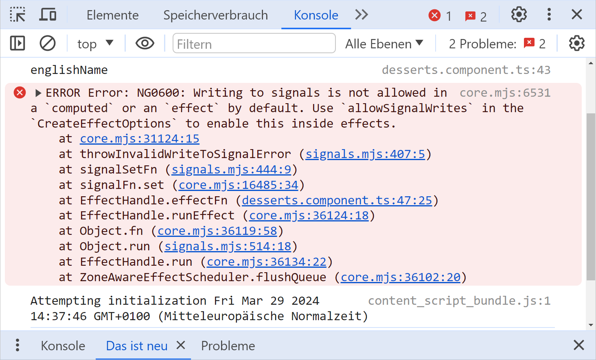
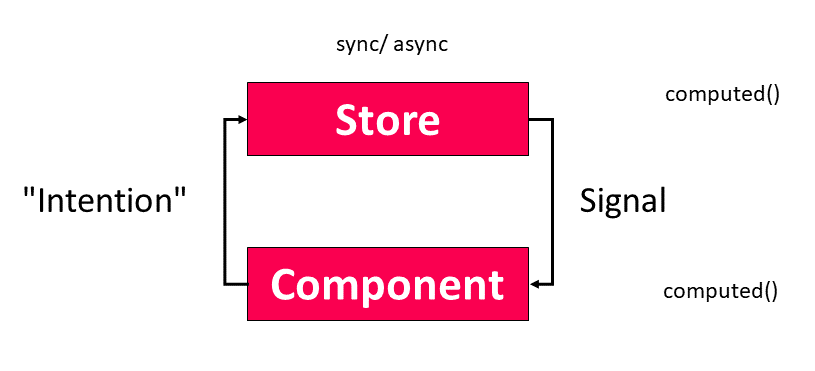

# Successful with Signals in Angular - 3 Effective Rules for Your Architecture

It is undisputed that Signals will shape the future of Angular. At first glance, they seem very easy to use: The setters take new values, the getters deliver the current values and the templates as well as Effects are notified about changes.

Now you might be tempted to treat Signals like normal variables. This works in principle and can be a practical option when migrating existing code. However, in this case, the advantages of Signals and reactive systems only result to a limited extent. There are also some pitfalls and the code is not as straightforward and hence not as maintainable as it could be.

In order to prevent such situations, I would like to use this chapter to give you three simple rules of thumb that allow Signals to be used as idiomatically as possible. 

📁 [Source Code](https://github.com/manfredsteyer/desserts.git) (see different branches!)

>Big thanks to Angular's [Alex Rickabaugh](https://twitter.com/synalx) for a great discussion that led to the idea for this chapter and for providing feedback.

## Initial Example With Some Room for Improvement

I would like to discuss the three promised rules using a simple Angular application:


The first implementation considered is not reactive and also offers some room for improvement:

```typescript
@Component([…])
export class DessertsComponent implements OnInit {
  #dessertService = inject(DessertService);
  #ratingService = inject(RatingService);
  […]

  originalName = '';
  englishName = '';
  loading = false;

  desserts: Dessert[] = [];

  ngOnInit(): void {
    this.search();
  }

  search(): void {
    const filter: DessertFilter = {
      originalName: this.originalName,
      englishName: this.englishName,
    };

    this.loading = true;

    this.#dessertService.find(filter).subscribe({
      next: (desserts) => {
        this.desserts = desserts;
        this.loading = false;
      },
      error: (error) => { […] },
    });
  }

  toRated(desserts: Dessert[], ratings: DessertIdToRatingMap): Dessert[] {
    return desserts.map((d) =>
      ratings[d.id] ? { ...d, rating: ratings[d.id] } : d,
    );
  }

  loadRatings(): void {
    this.loading = true;

    this.#ratingService.loadExpertRatings().subscribe({
      next: (ratings) => {
        const rated = this.toRated(this.desserts, ratings);
        this.desserts = rated;
        this.loading = false;
      },
      error: (error) => { […] },
    });
  }
  […]
}
```

Since the properties to be bound are neither Observables nor Signals, the strategy `OnPush` cannot be used for improving the data binding performance. Upon closer inspection, we also notice that the `loadRatings` method updates the `desserts` array, even though its actual task -- loading ratings -- has nothing to do with it.

Additionally, developers must remember that after any changes to the ratings, the `desserts` array must also be modified. This is exactly what can lead to hard-to-maintain code and hidden bugs -- especially when both `desserts` and `ratings` change at different points. Things become even more complex when additional data structures have to be taken into account in these calculations. The first rule of thumb presented here solves this issue.

## Rule 1: Derive State Synchronously Wherever Possible

The previously mentioned disadvantages can be compensated for with Signals. Since the introduction of Signals makes the component reactive, `OnPush` can now be activated. In addition, the component can derive its state from the individual Signals using `computed` synchronously:

```typescript
@Component({
  […],
  changeDetection: ChangeDetectionStrategy.OnPush,
})
export class DessertsComponent implements OnInit {
  #dessertService = inject(DessertService);
  #ratingService = inject(RatingService);

  originalName = signal('');
  englishName = signal('');
  loading = signal(false);

  desserts = signal<Dessert[]>([]);
  ratings = signal<DessertIdToRatingMap>({});
  ratedDesserts = computed(() => this.toRated(this.desserts(), this.ratings()));

  […]

  loadRatings(): void {
    this.loading.set(true);

    this.#ratingService.loadExpertRatings().subscribe({
      next: (ratings) => {
        this.ratings.set(ratings);
        this.loading.set(false);
      },
      error: (error) => { […] }
  });

  […]
}
```

This makes the code a lot more straightforward: The `loadRatings` method simply loads the ratings and places them in a signal. The `computed` Signal `ratedDesserts` takes care of mergining `desserts` and `ratings`. No matter when and where the application updates `desserts` or `ratings`, `ratedDesserts` is always up to date.

> Primary usage scenario of Signals: binding values reactively to the view.

When applying this pattern, it is important to note that `computed` can currently only derive state in a synchronous manner. This has to do with the primary usage scenario of Signals: binding values reactively to the view. It's possible that the Angular team will extend Signals to asynchronous scenarios over time. However, at the moment it is necessary to resort to other means. Rule 3 offers a straightforward approach to this.

## Rule 2: Avoid Effects for Propagating State

Effects are the right choice when presenting values cannot be achieved via data binding. However, they bring some pitfalls when used for propagating change. In the next sections, I elaborate on this.

### Proper Usage of Effects

In most cases, Signals are bound in the template. However, it happens that the desired form of output cannot be achieved via data binding. An example of this is outputting a Signal to the console for debugging purposes. Another example are toasts that can be activated via services and are intended to present the value of a Signal. For these cases, Angular provides Effects:

```typescript
[…]
constructor() {
  effect(() => {
    console.log('originalName', this.originalName());
    console.log('englishName', this.englishName());
  });
  
  effect(() => {
    this.#toastService.show(this.desserts().length + ' desserts loaded!');
  });
}
[…]
```

### Signals are Glitch-free

When writing code like in the previous section, we need to be aware that Signals are glitch-free. That means that if you change a signal several times in a row (within a stack frame), only the last change will be seen by the consumer, e.g. the effect:

```typescript
@Component([...])
export class AboutComponent {

  constructor() {
    const signal1 = signal('A');
    const signal2 = signal('B');

    effect(() => {
      console.log('signal1', signal1());
      console.log('signal2', signal2());
    });

    signal1.set('C');
    signal1.set('D');

    signal1.set('E');

    signal2.set('F');
  }
}
```

In this case, we will only see the values `E` and `F` on the console. Indemediate values are skipped.

This shows that Signals are not intended for modelling events but for data we want to bind to the view. In the latter case, we just need the current value while binding intermediate values would be counterproductive. For this reasons, the effects shown in the previous section are only triggered once even if there are several changes in a row. 

In cases where we want to express events, Observables are the way to go, as they don't have this glitch-free guarantee by design.

### Problematic Use of Effects

Even when using Effects, Signals are primarily used to transport the desired data into the view. In theory, however, Effects could also be used to transmit state to other Signals:

```typescript
effect(() => {
    this.originalName.set(this.englishName());
});
```

However, such approaches have several disadvantages, which is why Angular prohibits writing Signals within Effects by default:



One of these disadvantages is that unmanageable change cascades and thus difficult-to-maintain code and cyclic dependencies can arise. Since Effects register implicitly with all Signals used, the associated problems may not even be noticeable at first glance. If you still want to use Effects for writing, you can make Angular let things slide by setting `allowSignalWrites`:

```typescript
// Try hard to avoid this
effect(() => {
    this.originalName.set(this.englishName());
  },
  { allowSignalWrites: true },
);
```

> Application code should only use `allowSignalWrites` as a last resort.

The general consensus in the community is that application code should only use `allowSignalWrites` as a last resort. On the other hand, libraries like NGRX use this option internally. In this case, however, the authors of the library are responsible for its correct use, so application developers don't have to worry about it.

It is also important to note that the Effect itself registers with Signals in called methods too. For instance, the following Effect is triggered when Signals change within `search`:

```typescript
// Try hard to avoid this
effect(() => {
    this.search();
  },
  { allowSignalWrites: true },
);
```

This leads to a further increase in complexity. At least this problem could be alleviated with built-in features:

```typescript
// Try hard to avoid this
effect(() => {
    const originalName = this.originalName(); 
    const englishName = this.englishName();
    untracked(() => {
        this.load(originalName, englishName);
    })
  }
);
```

The `untracked` function avoids the current reactive context spilling over to the called `search` method. Angular now also uses this pattern itself in [selected cases](https://github.com/angular/angular/pull/54614). An example of this is triggering events in sub-components so that the event handler does not run in the reactive context of the code that triggered the event. Further popular libraries that use this technique are NGRX, NGRX Signal Store or ngextensions.

### Strategies for Preventing Effects With Signal Writes

Effects that spread data via Signal writes can in many cases be prevented using the following approaches:

- Consistent derivation of state using `computed` (see rule 1, above).
- Direct use of events that caused the Signal to change.

Instead of calling `search`, as indicated above, in an Effect, the application could instead use the change event of the input fields for the search filters. Observables can also be used as a source for such actions. The `search` method could, for example, also be triggered by the `valueChanges` observable of a `FormGroup`. In cases where you have just Signals, they can be converted into Observables using the RxJS Interop offered by Angular:

```typescript
@Component([…])
export class DessertsComponent {
  #dessertService = inject(DessertService);
  #ratingService = inject(RatingService);
  #toastService = inject(ToastService);

  originalName = signal('');
  englishName = signal('Cake');
  loading = signal(false);

  originalName$ = toObservable(this.originalName);
  englishName$ = toObservable(this.englishName);

  desserts$ = combineLatest({
    originalName: this.originalName$,
    englishName: this.englishName$,
  }).pipe(
    filter((c) => c.originalName.length >= 3 || c.englishName.length >= 3),
    debounceTime(300),
    tap(() => this.loading.set(true)),
    switchMap((c) => this.findDesserts(c)),
    tap(() => this.loading.set(false)),
  );

  desserts = toSignal(this.desserts$, {
    initialValue: [],
  });

  ratings = signal<DessertIdToRatingMap>({});
  ratedDesserts = computed(() => this.toRated(this.desserts(), this.ratings()));

  findDesserts(c: DessertFilter): Observable<Dessert[]> {
    return this.#dessertService.find(c).pipe(
      catchError((error) => {
        this.#toastService.show('Error loading desserts!');
        console.error(error);
        return of([]);
      }),
    );
  }
  […]
}
```

> The flattening operators offered by RxJS provide guarantees for overlapping asynchronous actions and thus prevent race conditions.

The use of Observables has several advantages at this point:
- In contrast to Signals, Observables are also suitable for triggering asynchronous actions.
- `toObservable` function strips the current reactive context using `untracked`.
- RxJS comes with a lot of powerful operators, like `debounceTime`.
- The flattening operators offered by RxJS provide guarantees for overlapping asynchronous actions and thus prevent race conditions. In the example shown, `switchMap` ensures that when search queries overlap, only the result of the last one is used and all others are canceled.

In many cases, one could argue that instead of converting a Signal into an Observable, it would be more appropriate to directly use the event that led to the Signal change, as proposed above. On the other hand, as Angular APIs increasingly adopt Signal-based approaches, using them directly will likely become more convenient and feel more intuitive. Therefore, this appears to be a gray area where we need to be mindful of the consequences, such as those associated with the glitch-free guarantee of Signals. 

## Rule 3: Stores Simplify Reactive Data Flow

Stores like the classic NGRX Store or the lightweight NGRX Signal Store not only take care of state management, but also help to keep the reactive data flow manageable:



The application forwards its intention to the store as part of an event. At this point, I use the term intention in an abstract, technology-neutral way, especially since different stores realize this aspect differently. With Redux and therefore also when using the classic NGRX store the application sends an action to the store, which forwards it to Reducer and Effects. For lightweight stores like the NGRX Signal Store, the application delegates to a method offered by the store instead.

> Offloading asynchronous operations to the store also compensates for the fact that Signals are currently only designed for synchronous actions.

The store then takes action and initiates synchronous or asynchronous operations. If the application uses RxJS for this, race conditions can be avoided with the flattening operators, as mentioned above. Offloading asynchronous operations to the store also compensates for the fact that Signals are currently only designed for synchronous actions.

The result of these operations leads to a change in the state managed by the store. This state can be expressed by Signals, which can be mapped to other Signals using computing (see rule 1). Such mappings can occur both in the store and in the component (or in another consumer of the store). This depends on how local or global the store and the data to be derived are.

The bottom line is that the consistent use of this approach supports the so-called unidirectional data flow, which makes system behavior more understandable. The following listing demonstrates this from the perspective of a component that relies on the NGRX Signal Store.

```typescript
@Component([…])
export class DessertsComponent {
  #store = inject(DessertStore);

  originalName = this.#store.filter.originalName;
  englishName = this.#store.filter.englishName;

  ratedDesserts = this.#store.ratedDesserts;
  loading = this.#store.loading;

  constructor() {
    this.#store.loadDesserts();
  }

  search(): void {
    this.#store.loadDesserts();
  }

  loadRatings(): void {
    this.#store.loadRatings();
  }

  updateRating(id: number, rating: number): void {
    this.#store.updateRating(id, rating);
  }

  updateFilter(filter: DessertFilter): void {
    this.#store.updateFilter(filter);
  }
}
```

Since the component only has to delegate to the store, it is very straightforward.

## Summary

To truly leverage the benefits of Signals, the application must be designed as a reactive system. This means, among other things, that writing values is avoided in favor of deriving values from existing ones. This simplifies the program code, especially since derived values are automatically kept up to date.

Signals are currently primarily suitable for transporting data into the view. Effects are used when API calls are necessary for that, e.g. when displaying a toast. The current Signals implementation is not intended to trigger asynchronous actions. Instead, classic events or observables are the way to go. Stores that can also handle asynchronous operations help establish unidirectional data flow and make reactive applications more manageable.