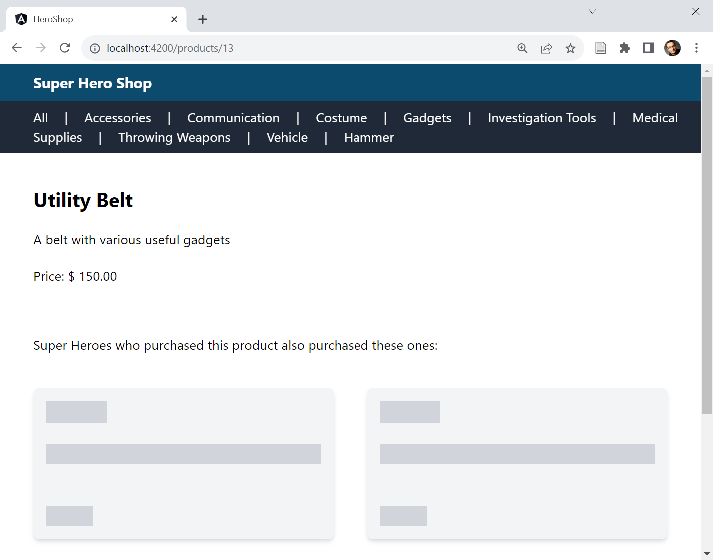
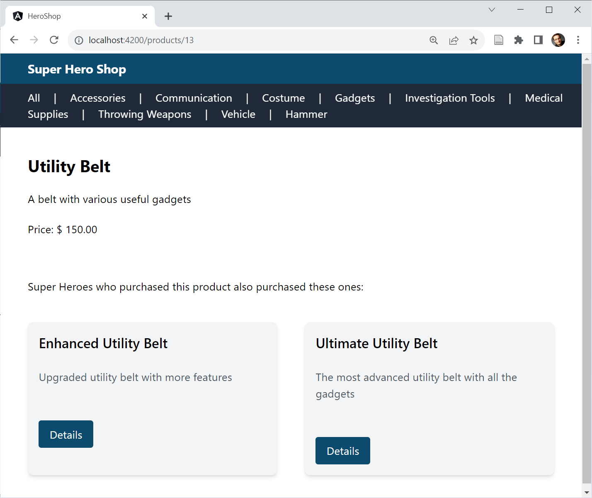

# Built-in Control Flow and Deferrable Views

Angular 17 introduced a new template syntax for control flow bocks. Also, the same syntax is used to provide deferrable views. These are lazy loaded parts of a page that help to improve the initial load performance. 

## New Syntax for Control Flow in Templates

Since its early days, Angular has used structural directives like _\*ngIf_ or _\*ngFor_ for control flow. Since the control flow needs to be revised anyway to allow for the envisioned fine-grained change detection and for eventually going Zone-less, the Angular team has decided to put it on a new footing. The result is the new build-in control flow, which stands out clearly from the rendered markup:

```html
@for (product of products(); track product.id) {
    <div class="card">
        <h2 class="card-title">{{product.productName}}</h2>
        […]
    </div>
}
@empty {
    <p class="text-lg">No Products found!</p>
}
```

One thing worth noting here is the new _@empty_ block that Angular renders when the collection being iterated is empty.

Although signals were a driver for this new syntax, they are not a requirement for its use. The new control flow blocks can also be used with classic variables or with observables in conjunction with the _async_ pipe.

The mandatory _track_ expression allows Angular to identify individual elements that have been moved within the iterated collection. This enables Angular (to be more precise: Angular's new reconciliation algorithm) to drastically reduce the rendering effort and to reuse existing DOM nodes. When iterating over collections of primitive types, e.g. Arrays with numbers or strings, _track_ could point to the pseudo variable _$index_ according to information from the Angular team:

```html
@for (group of groups(); track $index) {
    <a (click)="groupSelected(group)">{{group}}</a>
    @if (!$last) { 
        <span class="mr-5 ml-5">|</span> 
    }
}
```

In addition to _$index_, the other values known from _\*ngFor_ are also available via pseudo variables: _$count_, _$first_, _$last_, _$even_, _$odd_. If necessary, their values can be stored in template variables too:

```html
@for (group of groups(); track $index; let isLast = $last) {
    <a (click)="groupSelected(group)">{{group}}</a>
    @if (!isLast) { 
        <span class="mr-5 ml-5">|</span> 
    }
}
```

The new _@if_ simplifies the formulation of _else_/ _else-if_ branches:

```html
@if (product().discountedPrice && product().discountMinCount) {
    […]
}
@else if (product().discountedPrice && !product().discountMinCount) {
    […]
}
@else {
    […]
}
```

In addition, different cases can also be distinguished using a _@switch_:

```html
@switch (mode) {
    @case ('full') {
	  […]
    }
    @case ('small') {
      […]
    }
    @default {
      […]
    }
}
```

Unlike _ngSwitch_ and _\*ngSwitchCase_, the new syntax is type-safe. In the example shown above, the individual _@case_ blocks must have string values, since the _mode_ variable passed to _@switch_ is also a string.

The new control flow syntax reduces the need to use structural directives, which are powerful but sometimes unnecessarily complex. Nevertheless, the framework will continue to support structural directives. On the one hand, there are some valid use cases for it and on the other hand, despite the many exciting innovations, the framework needs to be made backwards compatible.

## Automatic Migration to Build-in Control Flow

If you would like to automatically migrate your program code to the new control flow syntax, you will now find a schematic for this in the `@angular/core package`:

```bash
ng g @angular/core:control-flow
```

## Delayed Loading

Typically, not all areas of a page are equally important. A product page is primarily about the product itself. Suggestions for similar products are secondary. However, this changes suddenly as soon as the user scrolls the product suggestions into the visible area of the browser window, the so-called view port.

For particularly performance-critical web applications such as web shops, it makes sense to defer loading less important page parts. This means that the really important elements are available more quickly. Until now, anyone who wanted to implement this idea in Angular had to do it manually. Angular 17 also dramatically simplifies this task with the new _@defer_ block:

```html
@defer (on viewport) {
    <app-recommentations [productGroup]="product().productGroup">
        </app-recommentations>
}
@placeholder {
    <app-ghost-products></app-ghost-products>
}
```

Using _@defer_ delays the loading of the enclosed page part until a certain event occurs. As a replacement, it presents the placeholder specified under _@placeholder_. In the demo application used here, ghost elements are first presented for the product suggestions:



Once loaded, _@defer_ swaps the ghost elements for the actual suggestions:



In the discussed example, the _on viewport_ event is used. It occurs once the placeholder has been scrolled into view. Besides this event, there are several other options too:

|Triggers|Description|
|--- |--- |
|on idle|The browser reports that there are no critical tasks pending (default).|
|on viewport|The placeholder is loaded into the visible area of the page.|
|on interaction|The user begins to interact with the placeholder.|
|on hover|The mouse cursor is moved over the placeholder.|
|on immediate|As soon as possible after the page loads.|
|on timer(duration)|After a certain time, e.g. on timer(5s) to trigger loading after 5 seconds.|
|when condition|Once the specified condition is met, e.g. when (userName !=== null)|

By default, _on viewport_, _on interaction_, and _on hover_ force a _@placeholder_ block to be specified. Alternatively, they can also refer to other page parts that can be referenced via a template variable:

```html
<h1 #recommentations>Recommentations</h1> 
@defer (on viewport(recommentations)) { 
    <app-recommentations […] />
} 
```

Additionally, _@defer_ can be told to preload the bundle at an earlier time. As with preloading routes, this approach ensures that bundles are available as soon as you need them:

```html
@defer(on viewport; prefetch on immediate) { […] }
```

In addition to _@placeholder_, _@defer_ also offers two other blocks: _@loading_ and _@error_. Angular displays the former one while it loads the bundle; the latter one is shown in the event of an error. To avoid flickering, _@placeholder_ and _@loading_ can be configured with a minimum display duration. The _minimum_ property sets the desired value:

```html
@defer ( […] ) { 
    […] 
} 
@loading (after 150ms; minimum 150ms) { 
    […] 
} 
@placeholder (minimum 150ms) { 
    […] 
}
```

The _after_ property also specifies that the loading indicator should only be displayed if loading takes longer than 150 ms.

## Conclusion

The new Built-in Control Flow Blocks stand out visually from the template's markup. The also pave the way for incrementally updating components. Deferrable Views use the same syntax and allow to postpone loading specific elements of a page to improve loading times.
