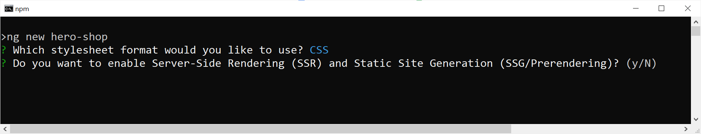
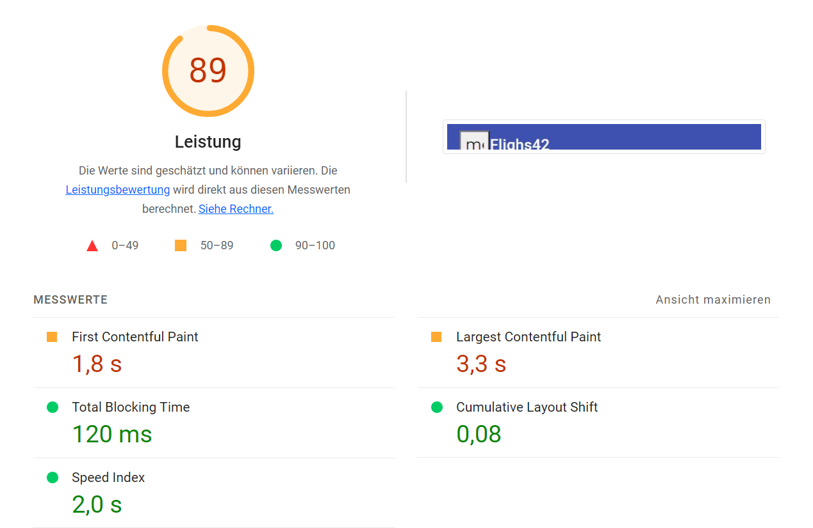
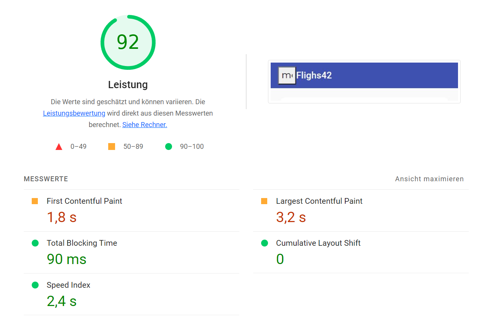

# esbuild and the new Application Builder

The new esbuild support provides faster builds. The subsequent `ApplicationBuilder` streamlines the use of SSR.

## Build Performance with esbuild

Originally, the Angular CLI used webpack to generate bundles. However, webpack is currently being challenged by newer tools that are easier to use and a lot faster. [esbuild](https://esbuild.github.io) is one of these tools that, with over 20,000 downloads per week, has a remarkable distribution.

The CLI team has been working on an esbuild integration for several releases. In Angular 16, this integration was already included as a developer preview. As of Angular 17, this implementation is stable and used by default for new Angular projects via the _Application Builder_ described below.

For existing projects, it is worth considering switching to esbuild. To do this, update the _builder_ entry in _angular.json_:

```json
"builder" : "@angular-devkit/build-angular:browser-esbuild"
```

In other words: _-esbuild_ must be added at the end. In most cases, _ng serve_ and _ng build_ should behave as usual, but be a lot faster. The former uses the [vite](https://vitejs.dev/) dev server to speed things up by only building npm packages when needed. In addition, the CLI team integrated several additional performance optimizations.

Calling _ng build_ is also drastically accelerated by using esbuild. Factor 2 to 4 is often mentioned as the range.

## SSR Without Effort with the new Application Builder

Support for server-side rendering (SSR) has also been drastically simplified with Angular 17. When generating a new project with _ng new, a --ssr_ switch is now available. If this is not used, the CLI asks whether it should set up SSR:



To enable SSR later, all you need to do is to add the _@angular/ssr package_:

```bash
ng add @angular/ssr
```

The _@angular_ scope makes clear, this package comes directly from the Angular team. It is the successor to the community project Angular Universal. To directly take SSR into account during _ng build_ and _ng serve_, the CLI team has provided a new builder. This so-called application builder uses the esbuild integration mentioned above and creates bundles that can be used both in the browser and on the server side.

A call to _ng serve_ also starts a development server, which both renders on the server side and delivers the bundles for operation in the browser. A call to _ng build --ssr_ also takes care of bundles for both worlds as well as building a simple Node.js-based server whose source code uses the schematics mentioned above.

If you can't or don't want to run a Node.js server, you can use _ng build --prerender_ to prerender the individual routes of the application during build.

## More than SSR: Non-destructive Hydration

Single page applications (SPAs) enable good runtime performance. However, the initial page load usually takes a few seconds longer than with classic web applications. This is because the browser has to load large amounts of JavaScript code in addition to the actual HTML page before it can render the page. The so-called First Meaningful Paint (FMP) only takes place after a few seconds:


While these few seconds are hardly an issue in business applications, they actually pose a problem for public web solutions such as web shops. Here it is important to keep the bounce rate low and this can be achieved, among other things, by keeping waiting times as short as possible.

It is therefore common to render SPAs for such scenarios on the server side so that the server can already deliver a finished HTML page. The caller is thus quickly presented with a page. Once the JavaScript bundles have loaded, the page is also interactive. The next image illustrates this: The First Meaningful Paint (FMP) now takes place earlier. However, the site will only become interactive later (Time to Interactive, TTI).


To support solutions where the initial page load matters, Angular has offered server-side rendering (SSR) since its early days. However, the behavior of this SSR implementation has been "destructive" in the past. This means that the loaded JavaScript code re-rendered the entire page. All server-side rendered markup was replaced with client-side rendered markup. Unfortunately, this is also accompanied by a slight delay and flickering. Metrics show that this degrades startup performance.

Angular 16 also addresses this issue by reusing the already server-side rendered markup from the JavaScript bundles loaded into the browser. We are talking about non-destructive hydration here. The word hydration describes the process that makes a loaded page interactive using JavaScript.

To use this new feature, first install the `@nguniversal/express-engine` package for SSR support:

```bash
ng add @nguniversal/express-engine
```

After that, non-destructive hydration is enabled with the standalone API `provideClientHydration`:

```typescript
// app.config.ts
export const appConfig: ApplicationConfig = {
  providers: [
    provideClientHydration(),
  ]
};
```

The listing sown takes care of this in the `app.config.ts` file . The structure of the `ApplicationConfig` type published there is used in the `main.ts` file when bootstrapping the application. Incidentally, the `app.config.ts` file is set up by the CLI when a new application is set up with the `--standalone` switch.

To debug an application that relies on SSR or hydration, the using schematics set up the npm script `ssr:dev`:

```bash
npm run ssr:dev
```

Behind it is a development server that was developed by an extremely charming Austrian collaborator and runs the application in debug mode on both the server and client side.

## More Details on Hydration in Angular

If the SPA calls Web APIs via HTTP during server-side rendering, the responses received are also automatically sent to the browser via a JSON fragment within the rendered page. When hydrating, the `HttpClient` in the browser uses this fragment instead of making the same request again. With this, Angular speeds up hydration. If this behavior is not desired, it can be deactivated with the `withNoHttpTransferCache` function:

```typescript
provideClientHydration(
    withNoHttpTransferCache()
),
```

For non-destructive hydration to work, the markup rendered on the server side must match the markup on the client side. This cannot always be guaranteed, especially with third-party components or when using libraries that manipulate the DOM directly. In this case, however, non-destructive hydration can be deactivated for individual components with the `ngSkipHydration` attribute:

```html
<app-flight-card 
      ngSkipHydration 
      [item]="f" 
      [(selected)]="basket()[f.id]" />
```

Angular does not allow data binding for this attribute. Also, Angular expects `ngSkipHydration` to be either zero or `true`. If you want to generally exclude hydration for a component, you can also set this attribute via a host binding:

```typescript
@Component({
  […]
  host: { 'ngSkipHydration': 'true' }
})
```

If several Angular applications run in parallel on one side, Angular must be able to distinguish between these applications using an ID. The token `APP_ID` is used for this:

```typescript
{ provide: APP_ID, useValue: 'myApp' },
```

The result of the new non-destructive hydration is quite impressive. The following two figures show some Lighthouse metrics for the example application used here. The former refers to classic SSR and the latter to the new non-destructive hydration.

**Classic SSR**:


**SSR with Non-Destructive Hydration**


Apart from creating a production build and enabling HTTP compression in the node-based web server responsible for server-side rendering, no optimizations have been implemented.